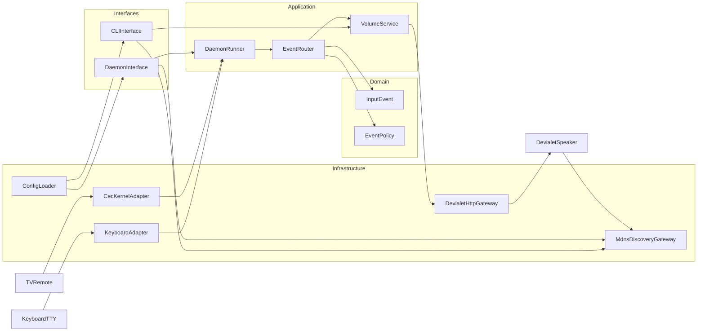
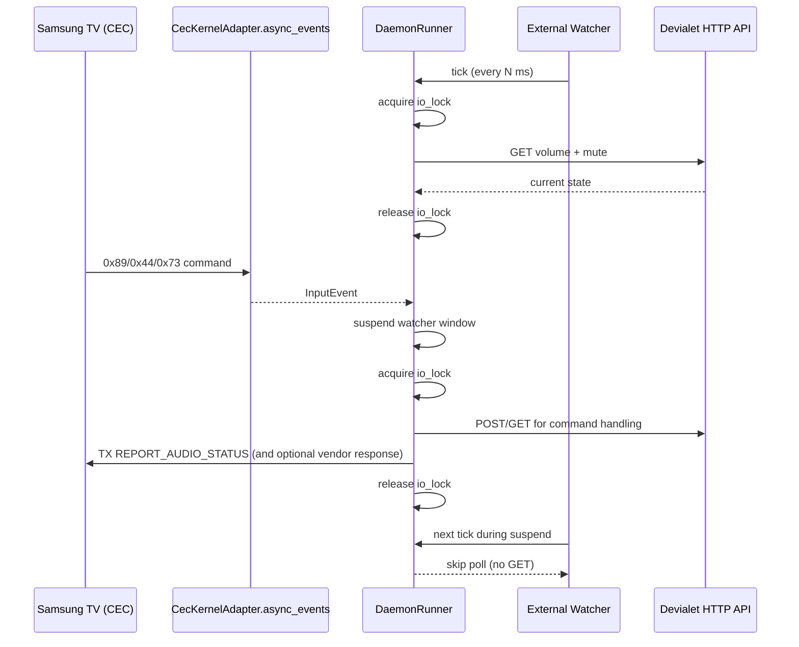

# Architecture

## Objective

Provide a maintainable local-control platform for Devialet Phantom volume, with:
- stable CLI commands for direct use and scripts
- daemon mode for event-driven inputs (CEC now, keyboard now, IR/HA later)
- clean separation of domain logic from I/O transports

## Design Principles

- Keep business behavior in `domain` + `application`, keep side effects in `infrastructure`.
- Preserve CLI compatibility while evolving internals.
- Treat input methods as adapters that emit normalized events.
- Prefer async-first I/O paths for runtime resilience and predictable concurrency.

## Layered Structure

- `src/devialetctl/domain`
  - `events.py`: canonical input/event types
  - `policy.py`: dedupe and rate-limit policy
- `src/devialetctl/application`
  - `service.py`: volume use-cases (including +1/-1 relative steps)
  - `router.py`: maps normalized events to actions
  - `daemon.py`: async CEC orchestration, watcher polling, and retry behavior
  - `ports.py`: contracts (`VolumeGateway`, discovery target models)
- `src/devialetctl/infrastructure`
  - `devialet_gateway.py`: async HTTP calls to Devialet API (`httpx.AsyncClient`)
  - `mdns_gateway.py`: zeroconf discovery + filtering
  - `cec_adapter.py`: Linux CEC kernel adapter (`/dev/cec0`, ioctl, async event stream)
  - `keyboard_adapter.py`: single-key or line-based keyboard input
  - `config.py`: typed runtime config (TOML + env overrides)
- `src/devialetctl/interfaces`
  - `cli.py`: argparse and command wiring
- Compatibility shims
  - `src/devialetctl/api.py`
  - `src/devialetctl/discovery.py`
  - `src/devialetctl/cli.py`

## Component Flow

## Command Surface

- Direct control:
  - `list`, `systems`, `getvol`, `setvol`, `volup`, `voldown`, `mute`
- Daemon:
  - `daemon --input cec`
  - `daemon --input keyboard`
- Target selection:
  - global args and daemon-specific target args (`--ip`, `--port`, `--base-path`, `--index`, `--discover-timeout`)

## Runtime Behavior

- mDNS discovery filters likely Devialet devices by service identity heuristics.
- Base path is normalized defensively:
  - `None`, `""`, `/` -> `/ipcontrol/v1`
  - missing leading slash is corrected.
- Relative volume operations are precise:
  - `volup` -> `current + 1`
  - `voldown` -> `current - 1`
  - fallback to native async `volumeUp/volumeDown` endpoint if get/set path fails.
- CEC daemon path is async-only:
  - `CecKernelAdapter.async_events()` reads kernel CEC frames
  - external Devialet watcher polls volume/mute and reports changes to TV
  - watcher polling and CEC command handling are serialized with an async lock
  - watcher is temporarily suspended while handling inbound CEC push commands
- Daemon policy protects API/device from repeated bursts:
  - dedupe window
  - minimum emit interval
  - retry/backoff loop for adapter failures.

## Concurrency Model

CEC daemon runtime has two concurrent async producers:
- CEC receiver stream (`async_events`) for inbound TV commands
- external watcher polling Devialet HTTP state

To avoid race conditions, both paths serialize all Devialet I/O and cache mutations with a shared async lock.  
Additionally, CEC handling temporarily suspends watcher polling while a push/update is in progress.

## Configuration Model

Config source priority:
1. CLI daemon target args (when provided)
2. Environment variables (`DEVIALETCTL_IP`, `DEVIALETCTL_PORT`, `DEVIALETCTL_BASE_PATH`)
3. TOML config (`~/.config/devialetctl/config.toml`)
4. built-in defaults

Relevant settings:
- target: `ip`, `port`, `base_path`, `discover_timeout`, `index`
- daemon: `cec_device`, `cec_osd_name`, `cec_vendor_compat`, `reconnect_delay_s`, `log_level`
- policy: `dedupe_window_s`, `min_interval_s`

## Compatibility Guarantees

- Existing imports continue to work:
  - `devialetctl.api.DevialetClient`
  - `devialetctl.discovery.discover`
  - `devialetctl.cli.main`
- Existing CLI commands remain available with same intent.

## Testing Strategy

Current test suite covers:
- CEC parser behavior
- keyboard parser behavior
- event policy dedupe/rate-limit
- daemon routing in CEC and keyboard modes
- CLI regressions (including daemon argument handling)
- mDNS filtering
- base-path normalization
- compatibility wrappers

## Extension Roadmap

Planned next adapters can reuse the same event pipeline:
- IR adapter (LIRC/GPIO)
- Home Assistant adapter (service calls or MQTT/webhook bridge)
- HDMI-CEC keymap tuning (long press, repeated key policy)
- optional `--dry-run` mode for safe observability
